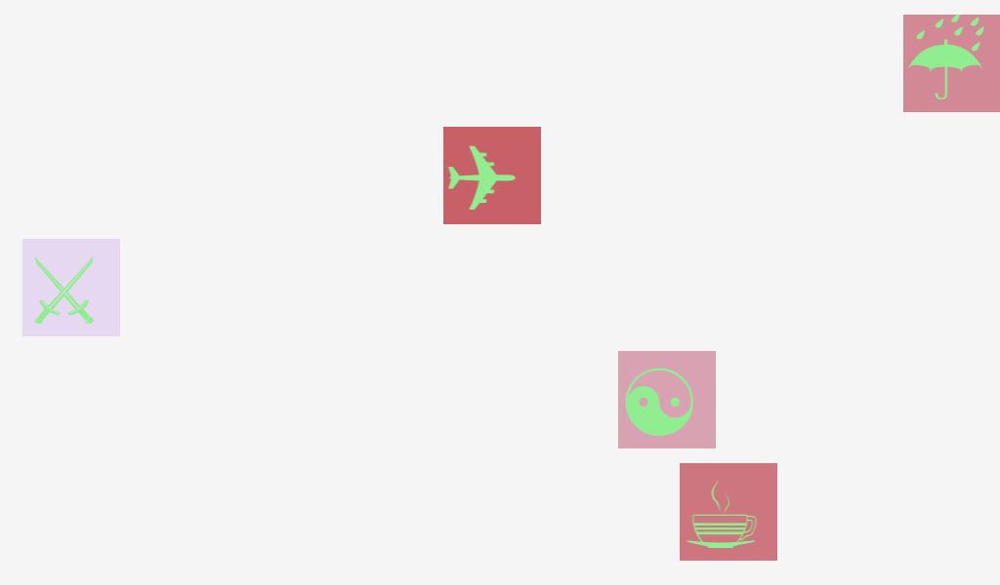

# Keyframe Animation plain JavaScript

## App Structure

```
\app
    \main.html
    \head.js
    \main.js
    \styles.css
```

### main.html

```html
<!-- // main.html -->

<div id="container"></div>
```

### head.js

```js
// head.js

blackberry.app.event.onSwipeDown(function () {
    // reload page on swipe down
    location.reload();
});

document.write('<link rel="stylesheet" type="text/css" href="' + App.ROOT_DIR_PATH + '\/app\/styles.css">');
```

### main.js

```js
// main.js

document.onreadystatechange = function () {
    console.log('document: ', document.readyState);
}

window.onload = function (event) {

    'use strict';

    console.log('window: ', event.type);

    (function () {

        var symbols = [
            '&#x2614;', // umbrella
            '&#x2708;', // airplane
            '&#x2694;', // swords
            '&#x262F;', // yin and yang
            '&#x2615;' // coffee

        ];

        var container = document.querySelector('#container'); 
        // <div id="container"></div> is defined in main.html

        // add boxes with symbols on screen
        symbols.forEach(function (symbol) {
            var box = document.createElement('div');
            box.className = 'box';
            box.innerHTML = '<p>' + symbol + '</p>';
            container.appendChild(box);

        });

        var boxes = document.querySelectorAll('.box');

        for (var i = 0; i < boxes.length; i++) {
            boxes[i].addEventListener('touchstart', function (event) {
                event.currentTarget.setAttribute('class', 'box--animated');
                event.currentTarget.addEventListener("webkitAnimationEnd", customFunction);
                console.log(event.type); // touchstart
            });

        }

        function customFunction(event) {
            event.target.removeEventListener("webkitAnimationEnd", customFunction);
            event.target.setAttribute('class', 'box');
            // console.log(event.target === event.currentTarget); // true
            console.log(event.type); // webkitAnimationEnd

        }

    })();

}

```

### styles.css

```css
body {
    background-color: #868e96;
}

@-webkit-keyframes over-and-back {
    0% {
        background-color: hsl(0, 50%, 50%);
        -webkit-transform: translate(0);
    }

    50% {
        -webkit-transform: translate(924px);
    }

    100% {
        background-color: hsl(270, 50%, 90%);
        -webkit-transform: translate(0);
    }
}

.box {
    width: 100px;
    height: 100px;
    background-color: green;
}

.box--animated {
    width: 100px;
    height: 100px;
    -webkit-animation: over-and-back 1.5s linear 3;
}

```

## screenshots



