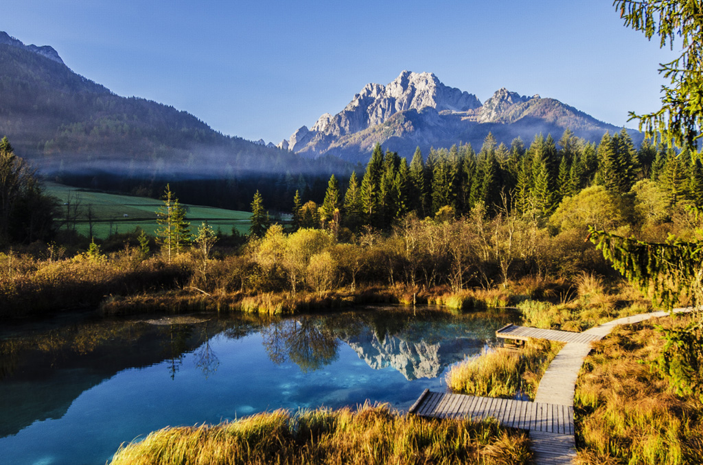

# Slider App with Coin Slider

## Folder Structure (using a "Pod" '\documents\pod[number]')

``` html
\css
\css\coin-slider-styles.css
\js
\js\head.js
\ales-krivec-1881-unsplash-1024.jpg
\coin-slider.js
\coin-slider.min.js
\jquery.min.js
\main.html
\main.js
\rob-morton-40594-unsplash-1024.jpg

```

## head.js
``` js
//head.js

var resolveImagesPath = "true";

;(function () {
    var cameraPath = blackberry.io.dir.appDirs.shared.camera.path;
    var sharedPath = blackberry.io.dir.getParentDirectory(cameraPath);
    var appFolderName = blackberry.app.name.toLowerCase().replace(/\s+/g, "");
    var appPath = sharedPath + "/documents/" + appFolderName;
    document.write('<' + 'script src="' + appPath + '\/jquery.min.js' + '" type="text\/javascript"><' + '\/script>');
    document.write('<' + 'script src="' + appPath + '\/coin-slider.min.js' + '" type="text\/javascript"><' + '\/script>');
})();

```

## main.html
``` html
<!-- // main.html -->

<style>
    body {
        margin: 0;
    }
</style>

<div id='coin-slider'>
    
    <span>text for the first image</span>
    
    <span>text for the second image</span>
</div>


```

## main.js
``` js
// main.js

blackberry.app.event.onSwipeDown(function () {
    // reload page on swipe down
    location.reload();
});

window.addEventListener("offline", function () {
    alert("offline")
}, false);

window.addEventListener("online", function () {
    alert("online")
}, false);

window.onload = function (e) {
    // statements to be executed

    //alert(typeof appPath === 'undefined');

    // check if online
    // var isOnline = ('blackberry' in window) ? blackberry.system.hasDataCoverage() : window.navigator.onLine;
    // alert("Online: " + isOnline);

    $('#coin-slider').coinslider({
        navigation: false,
        effect: 'random',
        width: 1024,
        height: 600
    });


}

```

## Coin Slider configuration
``` js
width: 565, // width of slider panel
height: 290, // height of slider panel
spw: 7, // squares per width
sph: 5, // squares per height
delay: 3000, // delay between images in ms
sDelay: 30, // delay beetwen squares in ms
opacity: 0.7, // opacity of title and navigation
titleSpeed: 500, // speed of title appereance in ms
effect: '', // random, swirl, rain, straight
navigation: true, // prev next and buttons
links : true, // show images as links 
hoverPause: true // pause on hover

```
