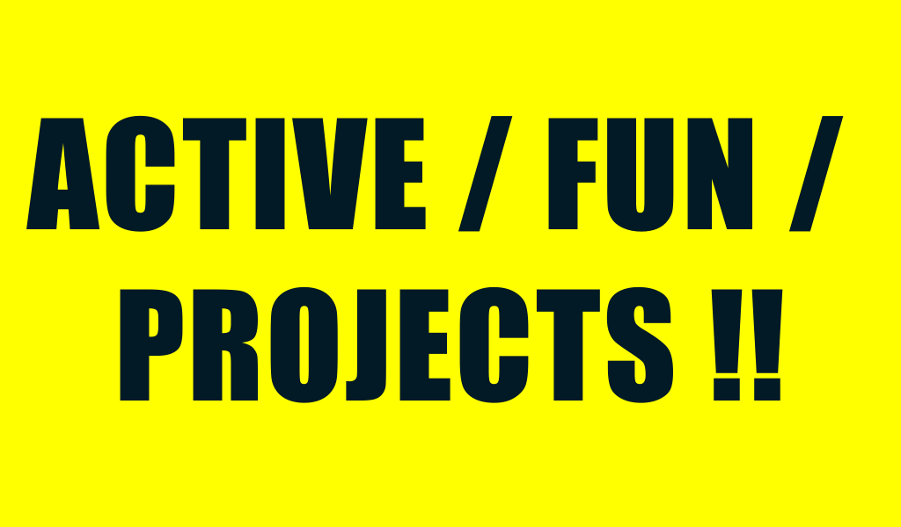

# active-fun-projects.html

``` html
<style>
    #main {
        width: 100%;
    }

    #left-side {
        width: 100%;
        height: 599px;
        margin: auto;
        float: left;
        background:yellow;
        color: #021926;
        font-family: 'Impact';
        text-transform: uppercase;
        font-size: 160px;
        letter-spacing: 3px;
        text-align: center;
        padding: 15px 0px;
        padding-top: 100px;
    }

</style>

<div id="main">

    <div id="left-side">
        active / fun /
        <br>projects !!</div>

</div>

```

## screenshot

