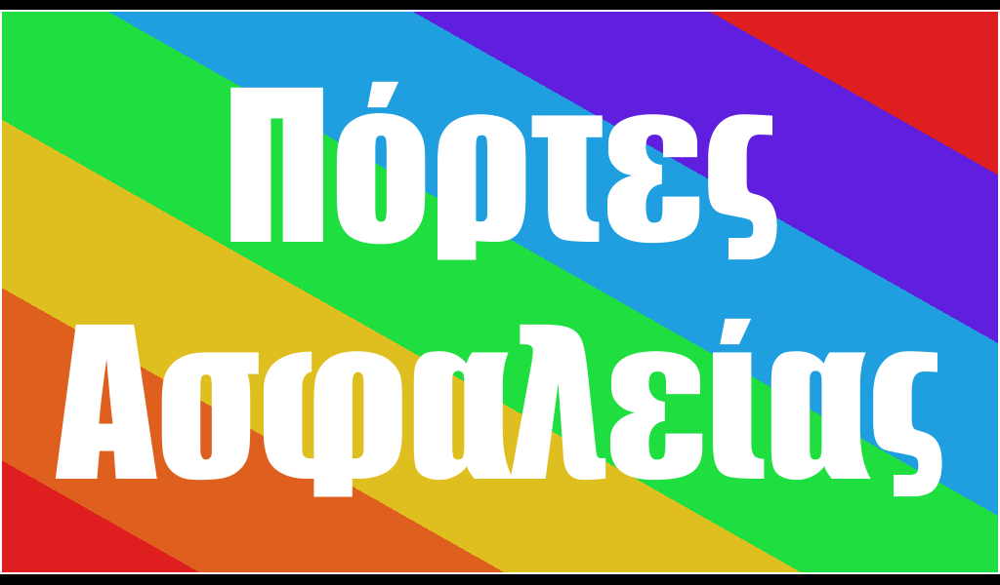

# greek-and-rainbow.html

``` html
<style>
    #main {
        border: 2px solid white;
        width: 99.7%;
        height: 575px;
        margin-top: 10px;

        background-image: -webkit-linear-gradient( 60deg,
        hsl(0, 75%, 50%) 10%,
        hsl(20, 75%, 50%) 10%,
        hsl(20, 75%, 50%) 25%,
        hsl(50, 75%, 50%) 25%,
        hsl(50, 75%, 50%) 40%,
        hsl(130, 75%, 50%) 40%,
        hsl(130, 75%, 50%) 55%,
        hsl(200, 75%, 50%) 55%,
        hsl(200, 75%, 50%) 70%,
        hsl(260, 75%, 50%) 70%,
        hsl(260, 75%, 50%) 85%,
        hsl(0, 75%, 50%) 85%);

    }

    #article {
        text-align: center;
        font-family: Impact;
        font-size: 200px;
        color: white;
        margin-top: 35px;
    }
</style>

<div id="main">
    <div id="article">Πόρτες Ασφαλείας</div>
</div>

```
## screenshot

